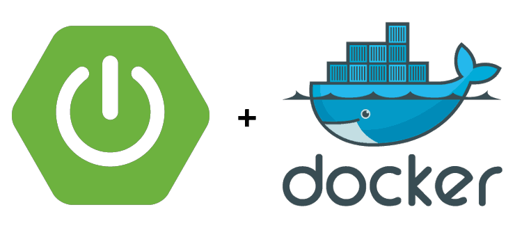
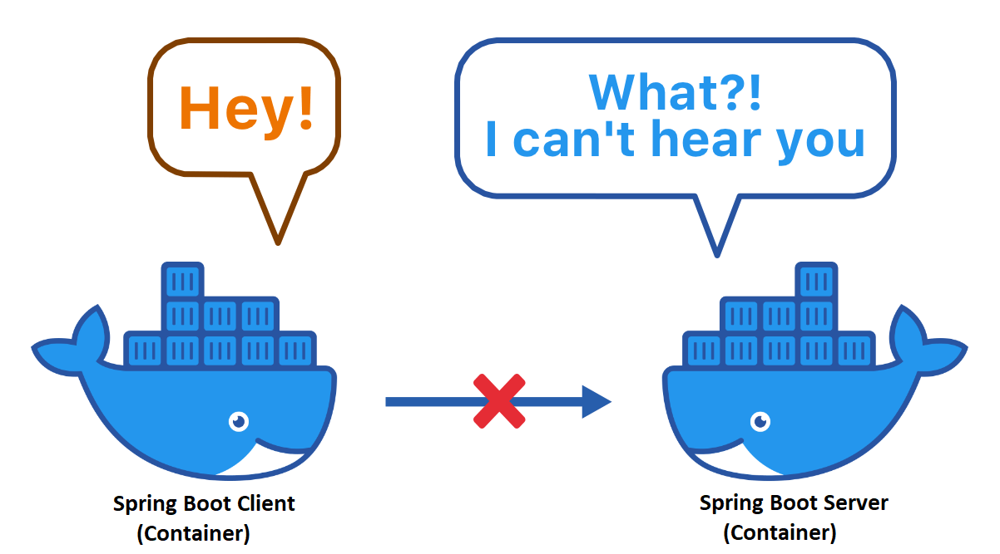

<h1 align="center">
  <br>
  <a>
  <br>
  springboot-docker-starterkit
  <br>
</h1>

Here I'll show how to deploy SpringBoot RESTful web service application with Docker and a communication between the containers.

### Prerequisite
Installed: [Docker](https://www.docker.com/), [Java 1.8](https://www.oracle.com/technetwork/java/javase/overview/index.html), [Maven 3.x](https://maven.apache.org/install.html), [Git](https://www.digitalocean.com/community/tutorials/how-to-contribute-to-open-source-getting-started-with-git)

### Steps
**Clone source code from git**
```
$ git clone https://github.com/exceptionalcode/springboot-docker-starterkit.git
```

**Maven build source code**\
To build spring-boot-client/spring-boot-server cd inside the directory
```
$ mvn clean install
```

**Build a Docker Image**\
To build an image go inside the spring-boot-client project directory on the location of **Dockerfile**
```
$ docker build -t spring-boot-client .
```
> **Note:** If you run this command for first time it will take some time in order to download base image from [DockerHub](https://hub.docker.com/)\

Same for the spring-boot-server
```
$ docker build -t spring-boot-server .
```
> (-t) represents the tag\
>(.) repesents the current directory for Dockerfile

**Docker Images**
```
$ docker images
REPOSITORY                           TAG                                              IMAGE ID            CREATED              SIZE
spring-boot-server                   latest                                           7026789d8203        12 seconds ago       121MB
spring-boot-client                   latest                                           fcba08ef1fb4        About a minute ago   121MB

```
> With comamnd '$ docker images' you'll see two images build above

**Run Docker Container** 
```
$ docker run --rm -d --name spring-boot-client -p 9001:9001 spring-boot-client
```
> --rm stands for exited when the container is stopped or removed\
> -d to start a container in the backgroud\
> --name giving name to a container\ 
> -p ports to map from container to ouside the world

Same with run the spring-boot-server container
```
$ docker run --rm -d --name spring-boot-server -p 9002:9002 spring-boot-server
```

**Test the container**\
Client application endopoint
```
$ curl http://localhost:9001/
```
Output : Hello from client


Server application endpoint 
```
$ curl http://localhost:9002/
```
Output : Hi!!!

**Call Client to Server App**\
To call Server endpoint(Container) from Client endpoint(Container)
```
$ curl http://localhost:9001/callServerFromClient
```
Output : {"timestamp":"2020-06-06T14:50:56.717+00:00","status":500,"error":"Internal Server Error","message":"","path":"/callServerFromClient"}

> **Here you can observer you can not communicate from one container to other**
<p align="center">
  
</p>

Since both the container are running on two diffrent networks, we would require them to connect on the same netowork.

**Create your own network**\
```
$ docker network create --driver=bridge springbootnet
```
> bridge is the network type and spring-boot-network is the name of a network


**List Network**
```
docker network ls
```

```
NETWORK ID          NAME                DRIVER              SCOPE
2894c742b8a8        bridge              bridge              local
9ddde2f74561        host                host                local
29e3be9c7b5d        none                null                local
ddc191b98c1a        springbootnet       bridge              local
```

**Connect contnainer on the network**
```
$ docker network connect springbootnet spring-boot-client
$ docker network connect springbootnet spring-boot-server
```

**Inpect the network**
```
$ docker inspect springbootnet
```
```
 "Containers": {
            "05d77b32de0c6d6e4862dec165d0bd96bbd6f055a6c1015cc68ecf98a2fe9cff": {
                "Name": "spring-boot-server",
                "EndpointID": "3a599a7220bc3782b9bfe03c2ab82bfa2f41bdb458955a0617e855ee181d2c84",
                "MacAddress": "02:42:ac:12:00:03",
                "IPv4Address": "172.18.0.3/16",
                "IPv6Address": ""
            },
            "66935f760ff8fee60745ec1617cf5ee24e1dbe5008da46bf92d296d0df14cbd9": {
                "Name": "spring-boot-client",
                "EndpointID": "7d3434989cabd1c23654f4e604aacf54e76041fae05d75d1f93a7751db1e7d23",
                "MacAddress": "02:42:ac:12:00:02",
                "IPv4Address": "172.18.0.2/16",
                "IPv6Address": ""
            }
```
Both the container are connected on the same **springbootnet** network

**Test Communitcation**\
Endpoint client calling server :
```
$ curl http://localhost:9001/callServerFromClient
```
Output : Hello from server

### Extra Commands 
**Stop Container**
```
$ docker stop <containerId>
```

**Remove Image**
```
$ docker rmi <imageTagName>
```
